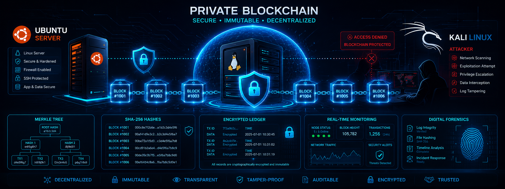
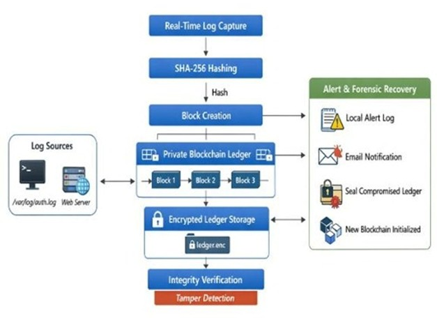
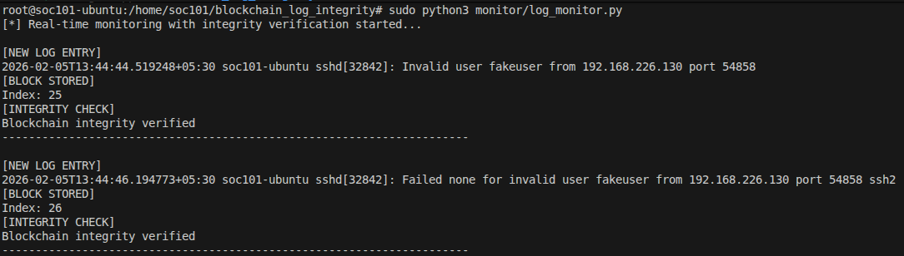
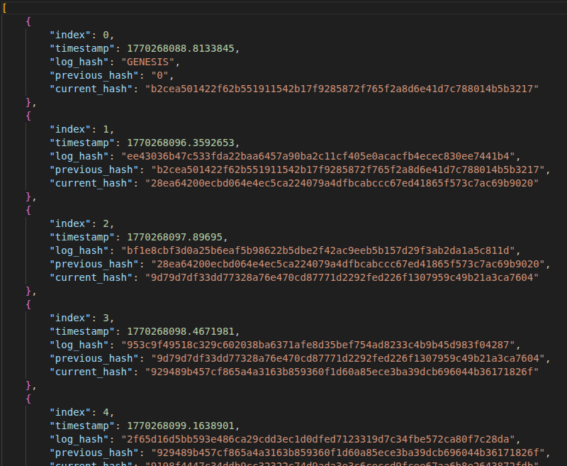
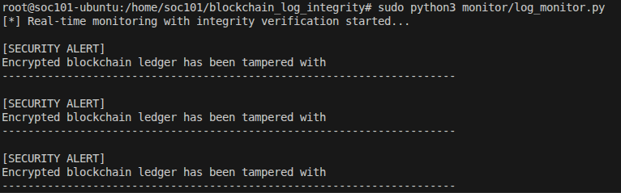
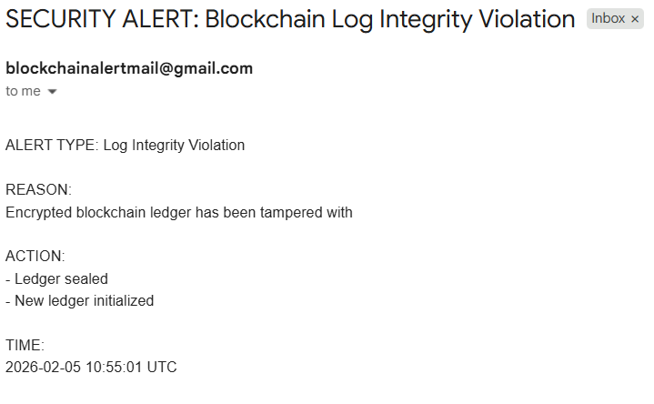
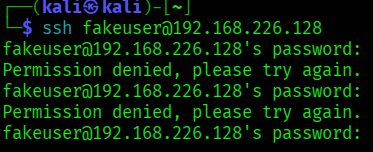

<div align="center">

# 🔐 Blockchain-Based Real-Time Log Integrity System

### A Lightweight Host-Based Blockchain Framework for Secure Linux Log Protection




</div>

---

# 📖 Overview

Modern Linux servers generate thousands of security logs every day.

These logs are the primary source of forensic evidence during cybersecurity investigations.

Unfortunately, traditional Linux logs are stored as plain-text files and can be modified or deleted once an attacker gains privileged access.

This project introduces a **host-based private blockchain framework** that protects log integrity immediately after log generation.

Unlike public blockchain solutions, this implementation is lightweight, fast, and designed specifically for Linux servers.

The system continuously monitors authentication and web server logs, hashes each entry using SHA-256, groups them into Merkle Trees, stores them inside an encrypted blockchain ledger, and performs continuous integrity verification.

Whenever tampering is detected, the system automatically:

- Generates forensic alerts
- Sends email notifications
- Preserves compromised evidence
- Creates a fresh trusted blockchain
- Continues monitoring without interruption

---

# 🚀 Features

✅ Real-Time Linux Log Monitoring

✅ SHA-256 Cryptographic Hashing

✅ Merkle Tree Batch Commitments

✅ Lightweight Private Blockchain

✅ AES Encrypted Ledger Storage

✅ Continuous Blockchain Verification

✅ Real-Time Tamper Detection

✅ Automatic Email Alerts

✅ Forensic Evidence Preservation

✅ Automatic Blockchain Recovery

✅ Linux Authentication Log Protection

✅ Nginx Web Server Log Protection

---

# 🏗 System Architecture



---

# 🔄 Workflow

```
Linux Logs
      │
      ▼
Watchdog Monitoring
      │
      ▼
SHA-256 Hashing
      │
      ▼
Merkle Tree Builder
      │
      ▼
Private Blockchain
      │
      ▼
AES Encrypted Ledger
      │
      ▼
Integrity Verification
      │
      ▼
Alert & Recovery
```

---

# 📂 Project Structure

```text
blockchain_log_integrity/

│
├── blockchain.py
├── log_monitor.py
├── hashing.py
├── merkle.py
├── encryption.py
├── verification.py
├── alerts.py
├── main.py
│
├── logs/
│
├── ledger/
│      ├── ledger.enc
│      └── sealed/
│
├── crypto/
│      └── ledger.key
│
├── images/
│
└── README.md
```

---

# ⚙ Technologies Used

| Technology | Purpose |
|------------|----------|
| Python | Core Development |
| Watchdog | Real-time File Monitoring |
| SHA-256 | Cryptographic Hashing |
| Merkle Tree | Batch Integrity |
| Private Blockchain | Immutable Storage |
| AES (Fernet) | Ledger Encryption |
| Ubuntu | Victim Server |
| Kali Linux | Attack Simulation |
| Nginx | Web Log Generation |

---

# 🔍 How It Works

### Step 1

Linux continuously generates:

- Authentication Logs

- Web Server Logs

---

### Step 2

Watchdog detects new log entries immediately.

---

### Step 3

Every log entry is hashed using SHA-256.

---

### Step 4

Hashes are collected into Merkle Tree batches.

---

### Step 5

The Merkle Root is stored inside a blockchain block.

---

### Step 6

The blockchain ledger is encrypted using AES.

---

### Step 7

Integrity verification continuously validates:

- Block Hash

- Previous Hash

- Merkle Root

---

### Step 8

Any tampering immediately triggers:

- Alert Generation

- Email Notification

- Evidence Sealing

- Blockchain Recovery

---

# 📸 Screenshots

## Ubuntu Monitoring



---

## Blockchain Ledger



---

## Tamper Detection



---

## Email Alert



---

## Attack Simulation



---

# 🧪 Experimental Setup

| Component | Configuration |
|-----------|---------------|
| Victim Machine | Ubuntu 22.04 LTS |
| Attacker Machine | Kali Linux |
| Web Server | Nginx |
| Language | Python 3.12 |
| Blockchain | Private |
| Encryption | AES (Fernet) |
| Hash Function | SHA-256 |

---

# 📊 Security Analysis

The system successfully detects:

- Log Modification

- Log Deletion

- Log Injection

- Blockchain Tampering

- Ledger Manipulation

- Byte-Level Changes

- Replay Attempts

- Unauthorized Access

---

# 📈 Performance

✔ Sub-millisecond detection

✔ Lightweight storage

✔ Low latency

✔ High throughput

✔ Automatic recovery

✔ Continuous monitoring

---

# 🔬 Research Contributions

✔ Lightweight private blockchain

✔ Host-level integrity enforcement

✔ Merkle Tree batching

✔ AES encrypted ledger

✔ Three-layer verification

✔ Automated forensic recovery

✔ Practical deployment model

---

# 🚀 Installation

Clone repository

```bash
git clone https://github.com/YOUR_USERNAME/blockchain-log-integrity.git
```

Go inside project

```bash
cd blockchain-log-integrity
```

Create virtual environment

```bash
python3 -m venv venv
```

Activate

```bash
source venv/bin/activate
```

Install packages

```bash
pip install -r requirements.txt
```

Run

```bash
sudo python main.py
```

---

# 🛡 Attack Simulation

Generate SSH authentication logs

```bash
ssh invaliduser@ubuntu-ip
```

Generate brute-force attack

```bash
hydra -l root -P passwords.txt ssh://ubuntu-ip
```

Generate web logs

```bash
ab -n 1000 -c 100 http://ubuntu-ip/
```

---

# 📚 Research Paper

This repository accompanies the research paper:

**Blockchain-Based Real-Time Log Integrity System**

Presented at

**2026 IEEE-NexoTech International Conference on Advanced Technologies and Innovations**

---

# 🔮 Future Improvements

- SIEM Integration

- Distributed Blockchain

- HSM Key Management

- Cloud Native Logging

- Kubernetes Support

- AI-based Threat Detection

- Parallel Blockchain Verification

---

# 👨‍💻 Author

**Prakash N**

M.Tech Network and Cyber Security

SRM Institute of Science and Technology

---

# ⭐ Support

If you found this project useful,

⭐ Star this repository.

Fork it.

Contribute.

Report issues.

---

<div align="center">

Made with ❤️ for Cybersecurity & Digital Forensics

</div>
